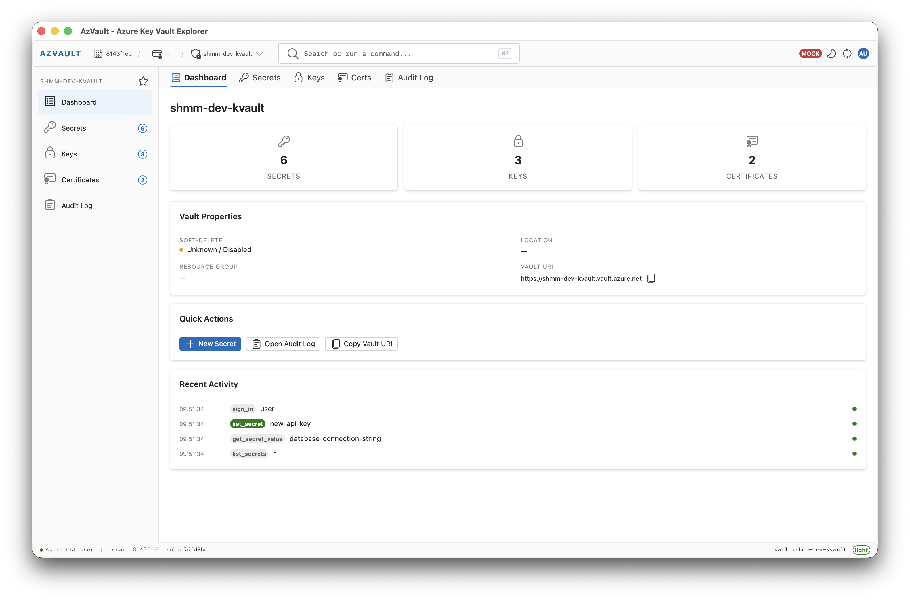
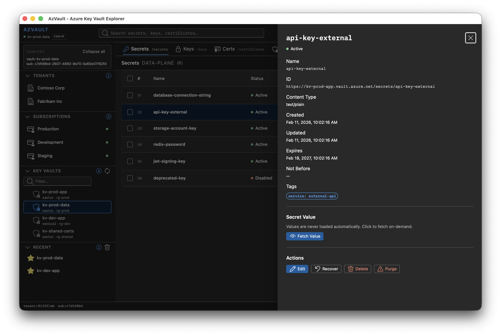
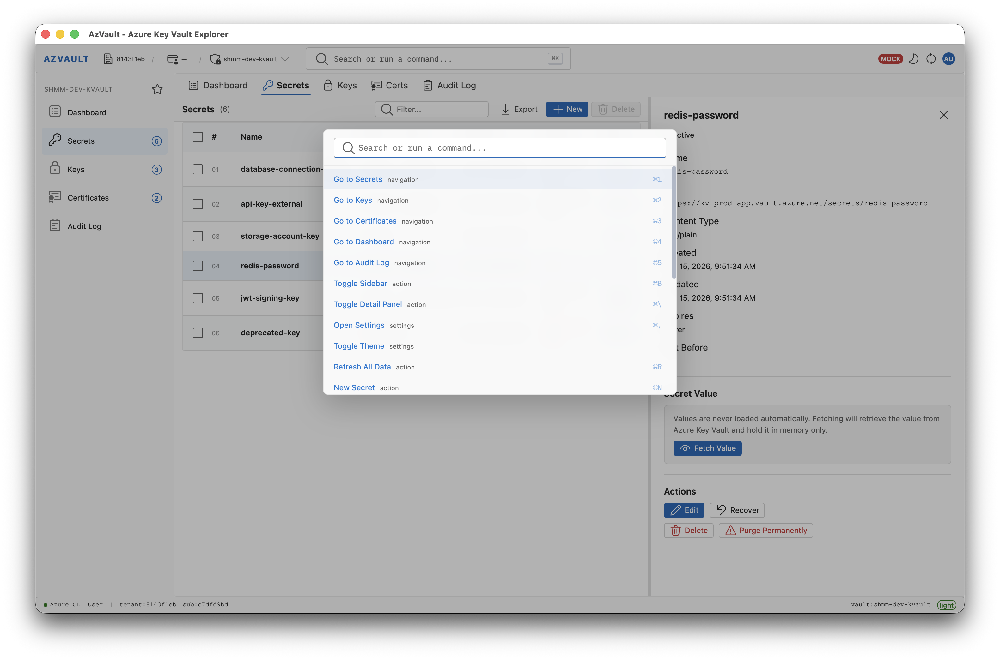

# AzVault

[](https://taraskovalenko.github.io/)

AzVault is a cross-platform desktop Azure Key Vault explorer built with:
- Tauri v2 (Rust)
- React + TypeScript + Vite
- Fluent UI

AzVault uses **Azure CLI authentication only**. You authenticate with `az login`, and the app requests short-lived tokens via `az account get-access-token`.

Main view             |  Secret view | Command view
:-------------------------:|:-------------------------:|:-------------------------:
  |   | 

## Terms of use

By using this project or its source code, for any purpose and in any shape or form, you grant your **implicit agreement** to all of the following statements:

- You unequivocally condemn Russia and its military aggression against Ukraine
- You recognize that Russia is an occupant that unlawfully invaded a sovereign state
- You agree that [Russia is a terrorist state](https://www.europarl.europa.eu/doceo/document/RC-9-2022-0482_EN.html)
- You fully support Ukraine's territorial integrity, including its claims over [temporarily occupied territories](https://en.wikipedia.org/wiki/Russian-occupied_territories_of_Ukraine)
- You reject false narratives perpetuated by Russian state propaganda

To learn more about the war and how you can help, [click here](https://war.ukraine.ua/). Glory to Ukraine! 🇺🇦

## Supported Platforms

- **Linux**
- **macOS**
- **Windows**

## Features

- Tenant/subscription/key vault discovery
- Browse Secrets, Keys, Certificates
- Secret metadata + explicit value fetch flow
- Secret CRUD lifecycle (set/delete/recover/purge)
- Import secrets from JSON file
- Bulk delete safety flow:
  - typed confirmation (`delete`)
  - collapsible list of selected secrets
  - live progress + failure count during delete
  - immediate UI removal for successfully deleted items
- Global search hotkey (`Ctrl+K` on Windows/Linux, `Cmd+K` on macOS)
- Local audit log with redaction/sanitized export
- VS Code-like operator UI with light/dark themes

## Authentication Model (CLI Only)

1. Run `az login`
2. (Optional) select default subscription: `az account set --subscription <id>`
3. Open AzVault and click **Connect with Azure CLI**

AzVault does not persist AAD refresh tokens or secret values.

## Threat Model (Short)

### In scope

- Prevent accidental secret exposure in logs/UI
- Restrict backend calls to Azure endpoints
- Validate user-provided vault URIs and secret names
- Keep audit data sanitized and size-bounded

### Out of scope

- Compromised local machine or compromised Azure CLI installation
- Clipboard exfiltration outside app controls
- Azure-side RBAC/access policy misconfiguration

## Local Data Storage

Stored locally:
- UI/session preferences (tenant/subscription/vault selection, recent vaults, theme)
- Local audit log entries (sanitized/redacted)

Never stored locally by app logic:
- Secret values
- Refresh tokens

## Repository Layout

- `src/`: React frontend
- `src-tauri/src/`: Rust backend
- `.github/workflows/`: CI workflows

## Prerequisites

- Node.js 20+
- Rust stable toolchain
- Azure CLI (`az`)
- Tauri OS prerequisites: [Tauri v2 prerequisites](https://v2.tauri.app/start/prerequisites/)

## Development

Install deps:

```bash
npm install
```

Run desktop app:

```bash
npm run tauri dev
```

Frontend-only mode:

```bash
npm run dev
```

Optional mock mode for UI development:

```bash
VITE_ENABLE_MOCK_MODE=true npm run dev
```

## Import Secrets from JSON

Use the **Import JSON** button in the Secrets toolbar, or run **Import Secrets from JSON** from the command palette.

Accepted formats:

```json
[
  {
    "name": "my-secret",
    "value": "secret-value",
    "contentType": "text/plain",
    "enabled": true,
    "expires": "2030-01-01T00:00:00Z",
    "notBefore": "2026-01-01T00:00:00Z",
    "tags": {
      "env": "prod"
    }
  }
]
```

or:

```json
{
  "secrets": [
    { "name": "my-secret", "value": "secret-value" }
  ]
}
```

Rules:
- `name` and `value` are required.
- `name` supports letters, numbers, and dashes only.
- `tags` must be an object with string values.
- `expires` and `notBefore` must be valid date strings.

Sample file: [`examples/secrets-import.example.json`](./examples/secrets-import.example.json)

## Quality Gates

Frontend:

```bash
npm run lint
npm run build
npm run test:react
```

Rust:

```bash
cd src-tauri
cargo fmt --check
cargo test
cargo check
```

## Security

Please read [SECURITY.md](SECURITY.md) before reporting vulnerabilities.

## License

MIT License - see [LICENSE](LICENSE) for details.
