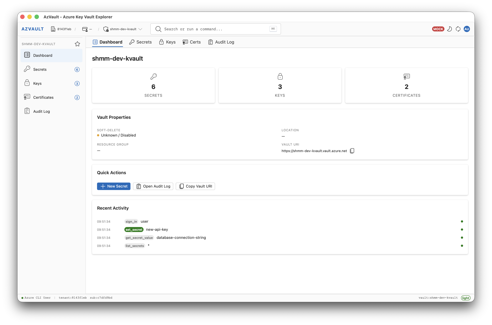
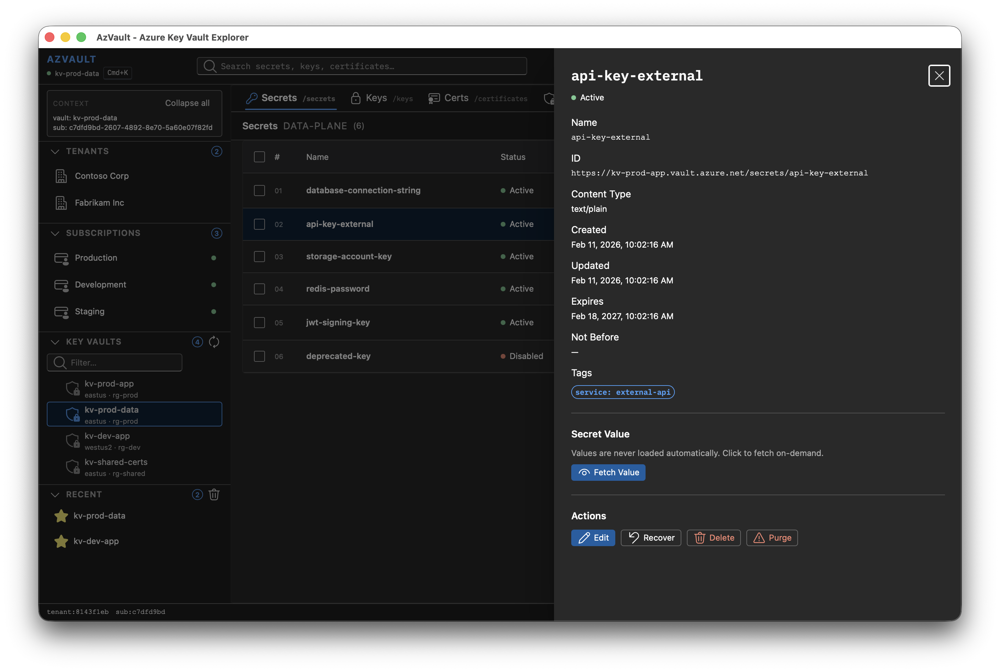
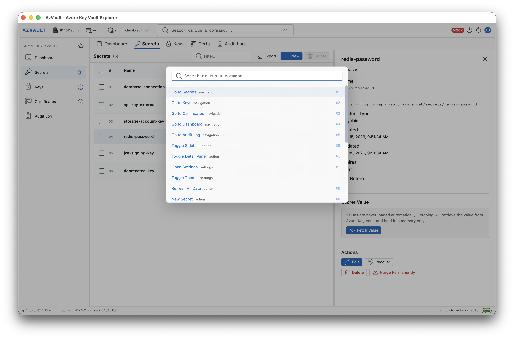

# AzVault

[](https://taraskovalenko.github.io/)

AzVault is a cross-platform desktop Azure Key Vault explorer built with:
- Tauri v2 (Rust)
- React + TypeScript + Vite
- Fluent UI

AzVault uses **Azure CLI authentication only**. You authenticate with `az login`, and the app requests short-lived tokens via `az account get-access-token`.

Main view             |  Secret view | Command view
:-------------------------:|:-------------------------:|:-------------------------:
  |   | 

## Terms of use

By using this project or its source code, for any purpose and in any shape or form, you grant your **implicit agreement** to all of the following statements:

- You unequivocally condemn Russia and its military aggression against Ukraine
- You recognize that Russia is an occupant that unlawfully invaded a sovereign state
- You agree that [Russia is a terrorist state](https://www.europarl.europa.eu/doceo/document/RC-9-2022-0482_EN.html)
- You fully support Ukraine's territorial integrity, including its claims over [temporarily occupied territories](https://en.wikipedia.org/wiki/Russian-occupied_territories_of_Ukraine)
- You reject false narratives perpetuated by Russian state propaganda

To learn more about the war and how you can help, [click here](https://war.ukraine.ua/). Glory to Ukraine! 🇺🇦

## Supported Platforms

- **Linux**
- **macOS**
- **Windows**

## Installation

Download the latest bundle for your platform from the [Releases](../../releases) page.

### Quick install (macOS / Linux)

```bash
curl -fsSL https://raw.githubusercontent.com/TarasKovalenko/AzVault/main/install.sh | sh
```

This detects your OS/architecture, downloads the matching release asset, verifies its
SHA256 checksum (and build provenance via `gh attestation verify` when the GitHub CLI is
available), and installs it:

- **macOS**: installs `AzVault.app` into `/Applications` (falling back to `~/Applications`
  when that's not writable) and strips the quarantine flag.
- **Linux**: installs the `.AppImage` into `~/.local/bin` (or `/usr/local/bin` as root);
  pass `--deb` to install the `.deb` package instead.

Useful flags and environment variables:

| Flag / env var | Purpose |
| --- | --- |
| `--version <tag>` / `AZVAULT_VERSION` | Install a specific release instead of latest |
| `--install-dir <dir>` / `AZVAULT_INSTALL_DIR` | Override the install directory |
| `--deb` | On Linux, install the `.deb` package instead of the AppImage |
| `--skip-checksum` / `AZVAULT_SKIP_CHECKSUM=1` | Continue if a release has no `SHA256SUMS` asset |
| `AZVAULT_VERIFY_PROVENANCE` | `auto` (default), `1` (require), or `0` (skip) provenance verification |
| `AZVAULT_REPO` | Install from a fork (default: `TarasKovalenko/AzVault`) |
| `--uninstall` | Remove the installed app/binary |

Run `curl -fsSL .../install.sh | sh -s -- --help` (or `./install.sh --help` from a clone)
for the full list. To uninstall:

```bash
curl -fsSL https://raw.githubusercontent.com/TarasKovalenko/AzVault/main/install.sh | sh -s -- --uninstall
```

Windows users should download the `.msi` or `.exe` installer directly from the
[Releases](../../releases) page; this script does not support Windows.

### macOS

macOS builds are **ad-hoc signed** (not notarized with an Apple Developer ID), so
Gatekeeper blocks them on first launch. This is expected. To open:

1. Move `AzVault.app` to `/Applications`.
2. Right-click `AzVault.app` → **Open** → **Open** (one time only).

If macOS still refuses ("damaged" / "cannot be opened"), strip the quarantine flag:

```bash
xattr -dr com.apple.quarantine /Applications/AzVault.app
```

After the first open, launch it normally.

## Features

- Tenant/subscription/key vault discovery
- Browse Secrets, Keys, Certificates
- Secret metadata + explicit value fetch flow
- Secret CRUD lifecycle (set/delete/recover/purge)
- Import secrets from JSON file
- Export secret metadata (never values) as JSON or CSV, written to your
  downloads folder — the app reports the path it wrote
- Bulk delete safety flow:
  - typed confirmation (`delete`, case-sensitive)
  - collapsible list of selected secrets
  - live progress + failure count during delete
  - immediate UI removal for successfully deleted items
- Sortable, filterable lists with per-tab state that survives tab switches
- Command palette and full keyboard operation (`Ctrl+K` / `Cmd+K`)
- Local audit log with redaction/sanitized export
- Dense operator UI with light/dark themes

## Authentication Model (CLI Only)

1. Run `az login`
2. (Optional) select default subscription: `az account set --subscription <id>`
3. Open AzVault and click **Connect with Azure CLI**

AzVault does not persist AAD refresh tokens or secret values.

## Threat Model (Short)

### In scope

- Prevent accidental secret exposure in logs/UI
- Restrict backend calls to Azure endpoints
- Validate user-provided vault URIs and secret names
- Keep audit data sanitized and size-bounded

### Out of scope

- Compromised local machine or compromised Azure CLI installation
- Clipboard exfiltration outside app controls
- Azure-side RBAC/access policy misconfiguration

## Local Data Storage

Stored locally:
- UI/session preferences (tenant/subscription/vault selection, recent vaults, theme)
- Local audit log entries (sanitized/redacted)

Never stored locally by app logic:
- Secret values
- Refresh tokens

## Repository Layout

- `src/`: React frontend
- `src-tauri/src/`: Rust backend
- `.github/workflows/`: CI workflows

## Prerequisites

- Node.js 20+
- Rust stable toolchain
- Azure CLI (`az`)
- Tauri OS prerequisites: [Tauri v2 prerequisites](https://v2.tauri.app/start/prerequisites/)

## Development

Install deps:

```bash
npm install
```

Run desktop app:

```bash
npm run tauri dev
```

Frontend-only mode:

```bash
npm run dev
```

Optional mock mode for UI development:

```bash
VITE_ENABLE_MOCK_MODE=true npm run dev
```

## Import Secrets from JSON

Use the **Import JSON** button in the Secrets toolbar, or run **Import Secrets from JSON** from the command palette.

Accepted formats:

```json
[
  {
    "name": "my-secret",
    "value": "secret-value",
    "contentType": "text/plain",
    "enabled": true,
    "expires": "2030-01-01T00:00:00Z",
    "notBefore": "2026-01-01T00:00:00Z",
    "tags": {
      "env": "prod"
    }
  }
]
```

or:

```json
{
  "secrets": [
    { "name": "my-secret", "value": "secret-value" }
  ]
}
```

Rules:
- `name` and `value` are required.
- `name` supports letters, numbers, and dashes only.
- `tags` must be an object with string values.
- `expires` and `notBefore` must be valid date strings.

Sample file: [`examples/secrets-import.example.json`](./examples/secrets-import.example.json)

## Quality Gates

Frontend:

```bash
npm run lint
npm run build
npm run test:react
```

Rust:

```bash
cd src-tauri
cargo fmt --check
cargo test
cargo check
```

## Security

Please read [SECURITY.md](SECURITY.md) before reporting vulnerabilities.

## License

MIT License - see [LICENSE](LICENSE) for details.
